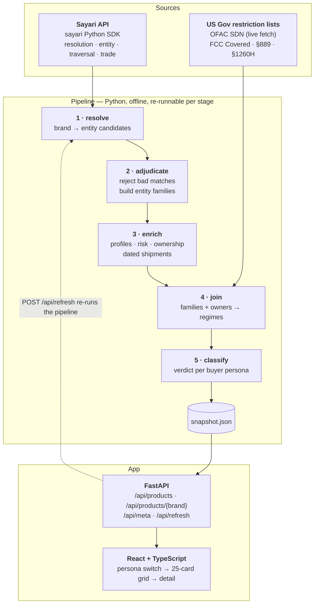

# Who's Allowed To Buy This?

**Sayari Forward Deployed Engineer technical exercise — Scenario 1: Entity Profile
Enrichment with External Source**

Twenty-five consumer smart-home devices — the cameras, routers, robot vacuums and TVs
on an ordinary Amazon shelf — resolved against Sayari's knowledge graph and enriched
with US government restriction lists.

---

## The question this answers

Your sanctions screening tool says these 25 products are fine. Every one of them is
legal for you to buy right now.

But **"legal" is not a property of the product. It's a property of the buyer.**

TP-Link is the best-selling router brand in America *and* appears on the US NDAA
Section 1260H list of Chinese Military Companies. Both are true. They live in
different legal universes: Section 1260H restricts **Department of Defense
procurement**, not consumer sales.

Nothing on the box tells you which situation you are in. This app does.

Pick a buyer profile — **Consumer · Enterprise IT · Federal Contractor · DoD
Supplier** — and the same 25 products re-tier in front of you.

### The finding that motivated the build

EZVIZ is a consumer camera brand. It appears on no restriction list of its own.
Three ownership hops later:

```
EZVIZ  (Hangzhou Ezviz Network Co., Ltd.)
  └─ has_shareholder →  Hangzhou Hikvision Digital Technology
                        [FCC Covered List · Section 889 · BIS Entity List]
      └─ has_shareholder →  CETC 52nd Research Institute
          └─ has_shareholder →  China Electronics Technology Group Corporation
                                [Chinese state defence conglomerate]
```

That path is invisible from the product listing and unreachable without a graph.

---

## Architecture



**Why a snapshot rather than live calls per request.** The landing page needs 25
entity families and several calls each. Serving a versioned snapshot keeps the demo
fast and working even if the key rate-limits, and lets a reviewer read the JSON
directly. `POST /api/refresh` re-runs the pipeline live, so the SDK path is real and
exercised, not decorative.

---

## Why these 25 products

The exercise supplies three lists (Russian state-owned enterprises, music labels,
auto suppliers). We built our own, because the supplied lists are pre-chewed — a list
of sanctioned Russian defence firms produces the demo every screening tool on the
market already gives.

Consumer smart devices work for reasons we verified against the live API before
committing:

| | |
|---|---|
| **Recognisable** | The aha lands with no domain briefing |
| **Import-dense** | Everything ships. TCL's family carries 3.5M shipment records; TP-Link 1.2M |
| **Genuinely hidden** | The findings are unreachable from the product page and require graph traversal |

The list lives in [`data/products.csv`](data/products.csv) (mirroring the column
format of the exercise's own lists) and [`data/products.json`](data/products.json)
with resolution metadata.

---

## What the enrichment adds

Sayari tells you what an entity is connected to. The external lists tell you **who is
legally barred from buying it** — and each regime binds a different population:

| Regime | Binds | Citation |
|---|---|---|
| **OFAC SDN** | all US persons — blocking sanctions | 31 CFR 501 |
| **Section 889** | federal agencies **and their contractors**, across the contractor's whole business | 48 CFR 52.204-25 |
| **FCC Covered List** | equipment authorisation — import/marketing of new devices | 47 CFR 1.50002 |
| **Section 1260H** | Department of Defense procurement only | 10 U.S.C. 113 note |

OFAC SDN is fetched live. The other three are short, statutory and stable, so they
are encoded with citations — `fcc.gov` and `dhs.gov` both return 403 to automated
clients.

---

## Running it

```bash
cp .env.example .env        # SAYARI_CLIENT_ID / SAYARI_CLIENT_SECRET

uv python install 3.12
cd backend && uv sync

uv run uvicorn app.main:app --reload        # http://localhost:8000
cd ../frontend && npm install && npm run dev # http://localhost:5173
```

**That is enough to review the app.** The API falls back to the committed
`sample.snapshot.json`, so the UI works with no Sayari credentials at all.

To rebuild the data against the live API:

```bash
cd backend
uv run python -m pipeline.run                  # full run, ~800 calls
uv run python -m pipeline.run --from enrich    # resume from one stage
uv run python -m pipeline.run --check          # verify stage freshness
uv run pytest                                  # 75 tests, no network
```

> **Python 3.12 is required.** The `sayari` package declares `>=3.8,<4.0` but ships
> classifiers only through 3.12 and is untested above it.

### The pipeline

Five stages, each persisting its own artifact so a later stage can be re-run
without repeating the API calls before it:

| Stage | Does | Notable because |
|---|---|---|
| `resolve` | brand → candidate entities | queries with *and* without the address hint; the hint improves match strength but changes the result set |
| `adjudicate` | keep/reject each candidate | rejections are published, not swallowed |
| `enrich` | profiles, risk, resolved chains | separates seed from network risk, drops deprecated factors |
| `external` | join to US restriction regimes | the Scenario 1 enrichment |
| `classify` | verdict per buyer persona | the thesis |

`--check` exists because stages communicate through files. Each artifact records
the fingerprint of what it consumed, so a stage that ran against stale input is
detectable rather than inferred from mtimes — which look fresh even when the
content behind them is not.

---

## Honesty constraints

This is a compliance tool, so overstating a finding is worse than not finding it.
The rules the code enforces are in [`AGENTS.md`](AGENTS.md). The load-bearing ones:

- **Seed vs network risk is always distinguished.** A flag derived by traversing the
  graph is never rendered as a property of the brand itself.
- **No ethical language.** We do not score morality. A verdict cites a statute or it
  does not render.
- **Sayari's own hedges are preserved.** Its copy says "possibly" and "may have."
- **Deprecated factors are excluded.** `sanctioned_adjacent` and
  `export_controls_adjacent` are still returned by the API but no longer shown in
  Sayari's own UI, so findings are re-derived from the target's own seed risk.
- **Sanctions claims are dated.** A shipment predating a counterparty's designation is
  not a violation, and is labelled as historical.
- **Coverage gaps are shown, not hidden.** Trade data is largely *pre-shipment bills
  of lading* rather than confirmed customs clearance, and covers 77 countries of which
  25 are sea-only — including US imports, China, Germany and the UK. Air and land
  freight from those origins is structurally invisible.
- **No data ≠ no risk.** Ring resolves cleanly with zero flags, but only because
  Amazon imports on its behalf. The UI says so rather than implying Ring is clean.

Rejected match candidates are kept in the output. The adjudication is part of the
deliverable — `REOLINK EZTECH DIGITAL` matching "ZTE" on a substring is exactly the
false positive a screening pipeline must catch.

---

## Future work

Documented rather than built, per the exercise's note about scope:

- **Product Blueprint traversal.** `/v1/supply_chain/upstream` with a `product` filter
  would trace each device's actual component value chain rather than relying on
  precomputed sub-tier risk factors.
- **Monitoring.** A real deployment would save these 25 as a Sayari *project* and use
  the notification endpoints to alert on risk changes, instead of rebuilding a
  snapshot.
- **Match adjudication UI.** Resolution is the weakest link; a human-in-the-loop
  review screen for candidates would matter more than any other addition.
- **Scale.** The pipeline is list-agnostic — 25 is a demo size, not a limit.
