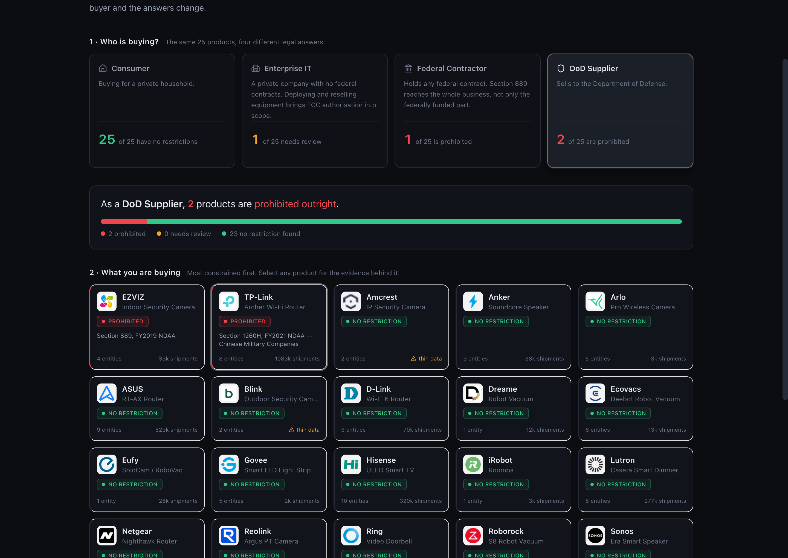
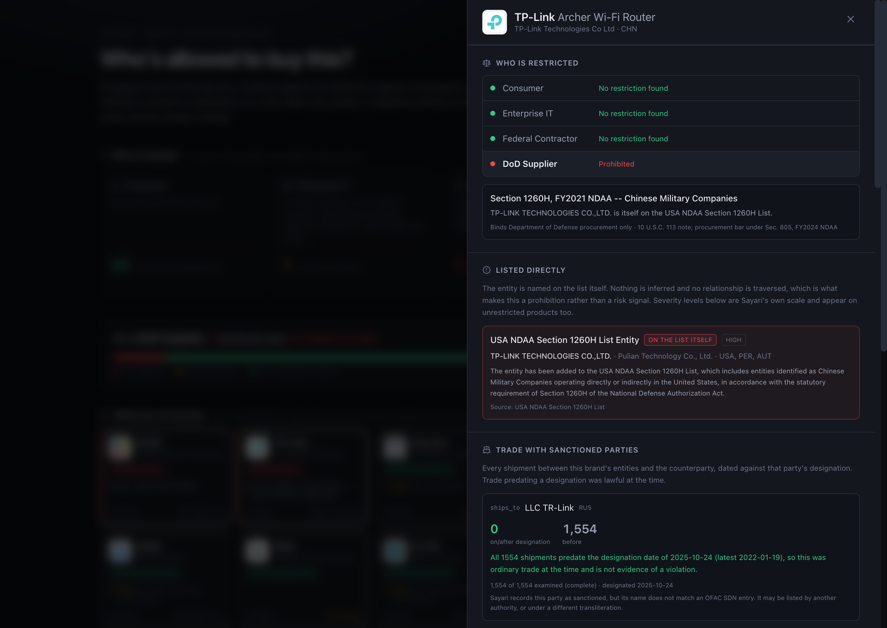
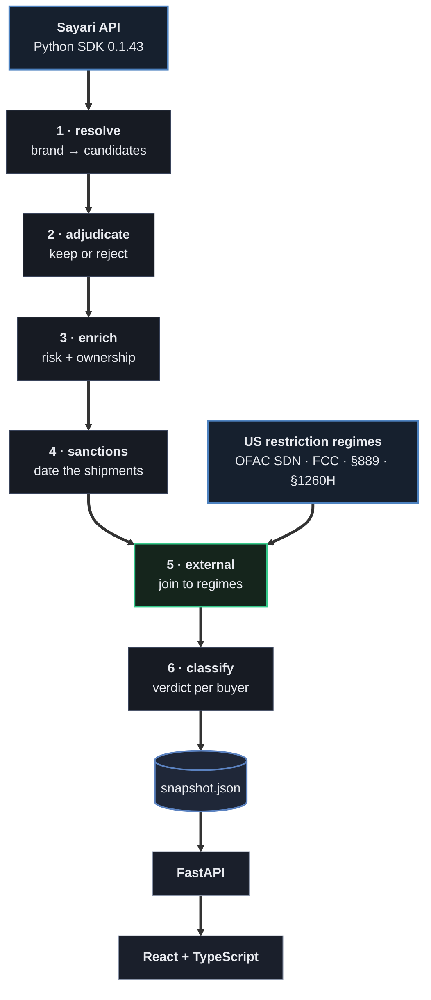

# Who's Allowed To Buy This?

**Sayari Forward Deployed Engineer exercise — Scenario 1: Entity Profile Enrichment
with an External Source**

25 popular smart home devices, resolved against Sayari's knowledge graph and enriched
with US government restriction lists, to answer one question: **who is legally barred
from buying this?**

Whether a product is restricted is not a fact about the product. It depends entirely
on who is buying it. The same camera is unremarkable in a house and barred in a
federal contractor's office, and nothing on the box tells you which situation you are
in.



<details>
<summary><b>The evidence behind one product</b> (click to expand)</summary>



</details>

---

## The escalation this is built to show

One product. Four buyers. Four different legal answers, each citing a statute.

| Buyer | EZVIZ camera | TP-Link router | Why it changes |
|---|---|---|---|
| **Consumer** | clear | clear | No US regime restricts a household from either |
| **Enterprise IT** | ⚠ review | clear | FCC Covered List reaches equipment authorisation |
| **Federal Contractor** | ⛔ **prohibited** | clear | §889 covers Hikvision "and any subsidiary or affiliate", and Hikvision holds **60%** of EZVIZ |
| **DoD Supplier** | ⛔ prohibited | ⛔ **prohibited** | §1260H bars DoD procurement from listed Chinese military companies |

TP-Link is the best-selling router brand in America **and** on a Department of Defense
prohibition list. Both are true; they bind different buyers.

### The finding underneath it

EZVIZ is a consumer camera brand. It appears on no restriction list of its own.
Three ownership hops later:

```
EZVIZ  (Hangzhou Ezviz Network Co., Ltd.)
  └─ has_shareholder (60%) →  Hangzhou Hikvision Digital Technology
                              [FCC Covered List · §889 · BIS Entity List]
      └─ has_shareholder →  CETC 52nd Research Institute
          └─ has_shareholder →  China Electronics Technology Group Corporation
                                [Chinese state defence conglomerate]
```

No list lookup finds that. No supplier questionnaire surfaces it. It needs a graph
over global corporate registries, which is precisely what Sayari is.

---

## Architecture



Six stages, each persisting its own artifact so a later stage can be re-run without
repeating the API calls before it. **267 Sayari calls build the entire snapshot.**

| Stage | What it does | Calls | Worth knowing |
|---|---|---:|---|
| `resolve` | brand name → candidate entities | 115 | Queries with *and* without the address hint. The hint raises match strength but also changes the result set. |
| `adjudicate` | keep or reject each candidate | 0 | 114 rejected, each with its reason, all published in the UI. |
| `enrich` | profiles, risk flags, ownership chains | 128 | Separates seed risk from network risk. Drops 262 deprecated flags. |
| `sanctions` | date shipments against designation | 24 | 2,696 shipments counted in full, not sampled. |
| `external` | join families and owners to restriction regimes | 0 | **The Scenario 1 enrichment.** OFAC SDN fetched live from Treasury. |
| `classify` | one verdict per buyer profile | 0 | A statute is cited, or nothing renders. |

**Why a snapshot rather than live calls per request.** The landing page needs 25
entity families and several calls each. Serving a versioned snapshot keeps the demo
fast and working even when the key rate-limits, and lets a reviewer read the JSON
directly. The pipeline is the SDK path, and it is real.

`pipeline.run --check` exists because stages communicate through files. Each artifact
records a fingerprint of what it consumed, so a stage that ran against stale input is
detectable rather than inferred from mtimes, which look fresh even when the content
behind them is not.

---

## How the data actually moves

The diagram above is the shape of the system. This one is the lineage: which
endpoint is called, what comes back, and what each field is used for.

```mermaid
flowchart LR
    PROD["<b>data/products.json</b><br/>25 brands · aliases · anchors"]

    subgraph R["① RESOLVE &nbsp;·&nbsp; 115 calls"]
        direction TB
        RES["<b>GET /v1/resolution</b><br/>×2 per name: with and<br/>without the address hint"]
        SUP["<b>POST /v1/trade/search/suppliers</b><br/>the trade-side entity, which<br/>resolution alone never returns"]
    end

    ADJ["<b>② ADJUDICATE</b> · 0 calls<br/>126 kept · 114 rejected"]

    subgraph E["③ ENRICH &nbsp;·&nbsp; 128 calls"]
        direction TB
        SUM["<b>GET /v1/entity_summary/:id</b><br/>×126, one per family member"]
        ONT["<b>GET /v1/ontology/risk_factors</b><br/>×1 → 721 definitions"]
        HOP["<b>GET /v1/entity_summary/:node</b><br/>ownership-chain hops only<br/>322 cached to disk"]
    end

    subgraph S["④ SANCTIONS &nbsp;·&nbsp; 24 calls"]
        direction TB
        RI["<b>GET /v1/entity/:id</b><br/>×12 counterparties<br/>attributes.risk_intelligence"]
        SHIP["<b>POST /v1/trade/search/shipments</b><br/>×12 · limit 3000<br/>2,696 shipments, counted in full"]
    end

    subgraph X["⑤ EXTERNAL &nbsp;·&nbsp; the enrichment"]
        direction TB
        OFAC["<b>OFAC SDN.CSV</b><br/>live from Treasury<br/>18,575 records"]
        SHARE["<b>GET /v1/entity/:id</b><br/>relationships_limit=50<br/>→ shares.percentage"]
        ENC["<b>Encoded + cited</b><br/>FCC Covered · §889 · §1260H<br/>fcc.gov and dhs.gov return 403"]
    end

    OUT["<b>⑥ CLASSIFY</b> · 0 calls<br/>one verdict per buyer profile"]

    PROD --> RES
    PROD --> SUP
    RES -->|"entity_id · score<br/>match_strength"| ADJ
    SUP -->|"trade entity ids"| ADJ

    ADJ -->|"126 entity ids"| SUM
    SUM -->|"risk · trade_count<br/>countries · sanctioned"| E2["<b>risk split</b><br/>seed vs network<br/>262 deprecated dropped"]
    ONT -->|"risk_type · level<br/>description · enabled"| E2
    SUM -->|"risk.metadata<br/>.traversal_path"| CHAIN["<b>ownership chains</b><br/>EZVIZ → Hikvision → CETC"]
    HOP -->|"label · sanctioned"| CHAIN

    CHAIN --> RI
    CHAIN --> SHIP
    RI -->|"from_date =<br/>designation date"| DATED["<b>dated evidence</b><br/>0 of 2,696 shipments<br/>post-designation"]
    SHIP -->|"arrival_date · hs_codes<br/>product_descriptions"| DATED

    E2 --> OUT
    DATED --> OUT
    CHAIN --> SHARE
    OFAC -->|"name → program<br/>RUSSIA-EO14024"| OUT
    SHARE -->|"60% → meets §889<br/>subsidiary or affiliate"| OUT
    ENC -->|"who each regime binds"| OUT

    classDef file fill:#1d2433,stroke:#6b7a94,stroke-width:1px,color:#e8eaef
    classDef apicall fill:#16202e,stroke:#4d82c0,stroke-width:1.5px,color:#e8eaef
    classDef ext fill:#2a2119,stroke:#c98a34,stroke-width:1.5px,color:#e8eaef
    classDef derived fill:#15251c,stroke:#34c98a,stroke-width:1.5px,color:#e8eaef
    classDef logic fill:#171b23,stroke:#39435a,stroke-width:1px,color:#e8eaef
    class PROD file
    class RES,SUP,SUM,ONT,HOP,RI,SHIP,SHARE apicall
    class OFAC,ENC ext
    class E2,CHAIN,DATED derived
    class ADJ,OUT logic
```



Reading it as a story:

1. **Resolution is queried twice per name**, with and without the address hint. The
   hint raises match strength but also *changes the result set*, and the trade-side
   entity it drops is the one carrying the shipment history. Trade search finds that
   node; resolution alone never returns it.
2. **`match_strength` drives adjudication**, not the verdict. 114 candidates are
   discarded here, each with a recorded reason.
3. **`entity_summary.risk` is the core payload.** Its `metadata.traversal_path` is
   the ownership chain, expressed as entity ids; resolving those ids is what turns
   `owned_by_usa_bis_entity` into *EZVIZ → Hikvision → CETC*.
4. **The ontology decides what counts.** `risk_type` splits seed from network, and
   `enabled` removes 262 deprecated flags before anything is reported.
5. **Designation dates come from `attributes.risk_intelligence`**, not from a
   sanctions list. Without them the shipment data says "ships to a sanctioned party";
   with them it says all 2,696 shipments predate the designation.
6. **`shares.percentage` decides severity.** §889 covers a named company "and any
   subsidiary or affiliate", so whether an ownership link is a bar depends on the
   size of the stake. Hikvision holds 60% of EZVIZ.
7. **OFAC SDN is the only list fetched live**, and it corroborates rather than
   originates: Sayari says the counterparty is sanctioned, Treasury's file confirms
   it by name and supplies the programme (`RUSSIA-EO14024`).

---

## What the enrichment adds

Sayari says what an entity is connected to. The external regimes say **who is barred
from buying it**, and each binds a different population. That difference is the app.

| Regime | Binds | Citation | Source |
|---|---|---|---|
| **OFAC SDN** | all US persons, blocking sanctions | 31 CFR 501 | fetched live from Treasury |
| **FCC Covered List** | equipment authorisation: import and marketing of new devices | 47 CFR 1.50002 | encoded |
| **Section 889** | federal agencies **and their contractors, across the whole business** | 48 CFR 52.204-25 | encoded |
| **Section 1260H** | Department of Defense procurement only | 10 U.S.C. 113 note | Sayari seed factor |

OFAC SDN is downloaded on each refresh and cross-checks every sanctioned counterparty
we find, carrying the sanctions programme through to the verdict. FCC and DHS both
return 403 to automated clients, and those two lists are short and statutory, so they
are encoded with citations rather than scraped.

---

## Why these 25 products

The exercise supplies three lists: Russian state-owned enterprises, music labels, auto
suppliers. We built our own, because a list of sanctioned Russian defence firms
produces the demo every screening tool already gives. Everything on it is already on a
list and nothing is surprising.

Consumer smart devices work for three reasons, all verified against the live API
before committing to them:

| | |
|---|---|
| **Recognisable** | The finding lands with no domain briefing |
| **Import-dense** | Everything ships. 5.1M shipment records across the list |
| **Genuinely hidden** | The findings are unreachable from the product page and require graph traversal |

The list is in [`data/products.csv`](data/products.csv), which mirrors the
`name,address,country` format of the exercise's own sheets, and
[`data/products.json`](data/products.json) with the resolution metadata.

---

## Running it

```bash
cp .env.example .env        # SAYARI_CLIENT_ID / SAYARI_CLIENT_SECRET

uv python install 3.12
cd backend && uv sync
uv run uvicorn app.main:app --reload            # http://localhost:8000

cd ../frontend && npm install && npm run dev    # http://localhost:5173
```

**That is enough to review the app.** The API falls back to the committed
`sample.snapshot.json`, so the UI works with no Sayari credentials at all.

To rebuild against the live API:

```bash
cd backend
uv run python -m pipeline.run                 # full run, 267 calls, ~6 min
uv run python -m pipeline.run --from enrich   # resume from one stage
uv run python -m pipeline.run --check         # verify stage freshness
uv run python -m pipeline.run --rehydrate     # rebuild stages from the snapshot, 0 calls
uv run pytest                                 # 89 tests, no network
```

> **Python 3.12 is required.** The `sayari` package declares `>=3.8,<4.0` but ships
> classifiers only through 3.12 and is untested above it.

---

## Honesty constraints

This is a compliance tool, so overstating a finding is worse than not finding one. The
rules the code enforces are in [`AGENTS.md`](AGENTS.md). The load-bearing ones:

- **Seed and network risk are always distinguished.** A flag derived by traversing the
  graph is never rendered as a property of the brand itself.
- **No ethical language.** We do not score morality. A verdict cites a statute or it
  does not render.
- **Severity follows the data, not the demo.** Whether an ownership link meets §889's
  "subsidiary or affiliate" test depends on the size of the stake, so the pipeline
  reads it: Hikvision holds 60% of EZVIZ. A minority holding stays a diligence
  trigger, and an unmeasured one is never assumed to clear the bar.
- **Sanctions claims are dated.** All 2,696 shipments to sanctioned counterparties
  predate designation, so none of them restricts anybody. They appear as context on
  the product page and produce no verdict. Undated, this would have read as
  "consumer brands ship to an OFAC-SDN Russian entity", which is false.
- **Sayari's own hedges are preserved.** Its copy says "possibly" and "may have".
- **Deprecated factors never support a finding.** `sanctioned_adjacent` is still
  returned by the API but retired in Sayari's ontology; its traversal path is walked
  as a route, then asserted against the target's own seed risk.
- **Coverage gaps are shown, not hidden.** Trade data is largely *pre-shipment bills of
  lading* rather than confirmed customs clearance, and covers 77 countries of which 25
  are sea-only, including US imports, China, Germany and the UK.
- **No data ≠ no risk.** Ring resolves with zero flags only because Amazon imports on
  its behalf, and the UI says exactly that.

Rejected candidates stay in the output. `REOLINK EZTECH DIGITAL` matching "ZTE" on a
substring is precisely the false positive a screening pipeline has to catch, and
publishing the catch is more credible than never mentioning it.

---

## Future work

Documented rather than built, per the exercise's note about scope:

- **Product Blueprint traversal.** `/v1/supply_chain/upstream` with a `product` filter
  would trace each device's actual component value chain rather than relying on
  precomputed sub-tier risk factors.
- **Monitoring.** A real deployment would save these 25 as a Sayari *project* and use
  the notification endpoints to alert on risk changes, rather than rebuilding a
  snapshot.
- **Match adjudication UI.** Resolution is the weakest link in the chain. A
  human-in-the-loop review screen for candidates would matter more than any other
  addition.
- **Scale.** The pipeline is list-agnostic. 25 is a demo size, not a limit.
